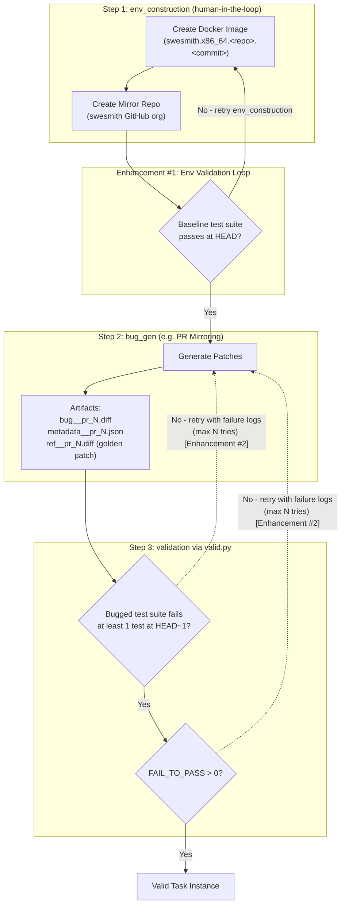

# Validation Loop 

Issue 195 created by @danielzayas on 2026-01-06: 
https://github.com/SWE-bench/SWE-smith/issues/195

## TLDR

The Self-Play SWE-RL [paper](https://arxiv.org/abs/2512.18552) has a good validation loop idea. Let's copy the pattern 😇 (slack [thread](https://swe-bench.slack.com/archives/C08URFC7S1F/p1766969527046769)). 

## Self-Play SWE-RL

"each input to SSR consists solely of a pre-built Docker image" input :arrow_right: bug-injection agent a) creates test_script.sh (versus human-in-the-loop creation of RepoProfile.test_cmd for SWE-smth) and other task instance artifacts (versus human-in-the-loop [create_instances](https://github.com/SWE-bench/SWE-smith/blob/7329a01b56ce1e64873b9d60a6bcb1a9375a0f3d/docs/guides/create_instances.md) for SWE-smith) then iterates until the candidate task achieves "Consistency validation" as defined in Figure 4 (versus human-in-the-loop [validation](https://github.com/SWE-bench/SWE-smith/blob/7329a01b56ce1e64873b9d60a6bcb1a9375a0f3d/docs/guides/harnesses.md#validation) for SWE-smith) :arrow_right: output validated artifacts with less human-in-the-loop. I imagine this save a lot of developer time! :smiley::rocket: :rocket: :rocket:

## SWE-smith Status Quo

Basically the current system requires a human in the loop for:

1. [env_construction](https://github.com/SWE-bench/SWE-smith/blob/7329a01b56ce1e64873b9d60a6bcb1a9375a0f3d/docs/guides/env_construction.md):  
    a) Create a Docker image (`swesmith.x86_64.<repo>.<commit>`) which contains the installed codebase.  
    b) Create a mirror of the original repository at the specified commit, created under a Github organization (e.g. [`swesmith`](https://github.com/orgs/swesmith/repositories) Github org)

2. [bug_gen](https://github.com/SWE-bench/SWE-smith/tree/fa9be530a50f6e0fbc54a3dd840176c4c9e91b14/swesmith/bug_gen) (mirror or llm modify or procedural generate or combine) followed by collect_patches. I'm particularly fond of the PR mirroring approach ([pr_mirroring](https://github.com/SWE-bench/SWE-smith/blob/7329a01b56ce1e64873b9d60a6bcb1a9375a0f3d/docs/guides/pr_mirroring.md)), which produces the following artifacts:
    a) `bug__pr_<PR_NUM>.diff`: The bug-introducing patch.
    b) `metadata__pr_<PR_NUM>.json`: Contains execution details such as `recover_status` ("success", "failed", "skipped"), LLM usage costs, and the raw rewrites generated by the model.
    c) `ref__pr_<PR_NUM>.diff`: The original PR patch, saved for reference and potentially used as the "Golden Patch" (solution) for the final task instance.

3. validation via [valid.py](https://github.com/SWE-bench/SWE-smith/blob/fa9be530a50f6e0fbc54a3dd840176c4c9e91b14/swesmith/harness/valid.py) is used to check if a candidate task instance achieves the following success criteria (see [harnesses](https://github.com/SWE-bench/SWE-smith/blob/7329a01b56ce1e64873b9d60a6bcb1a9375a0f3d/docs/guides/harnesses.md#validation)):
    a) Baseline test suite runs successfully at HEAD.
    b) Bugged test suite fails at least one test at HEAD~1.
    c) Identify Regressions (FAIL_TO_PASS). If len(FAIL_TO_PASS) > 0 -> VALID INSTANCE.

When validation fails, which it often does, the developer must manually go back to the beginning and retry/iterate. 

## Enhancements

1. Add a validation loop for the newly created Docker image + mirroed repository. For example, all tests at the HEAD commit should pass. We should know that the test suite runs successfully at HEAD before moving on to the next step.
2. Add a loop for the bug-introducing patch + validation. Iterate until at least one test fails at HEAD~1. Logs from failures during try N should be included in the new prompt for try N+1 (and logs from attempt N-1 should be excluded). Max number of tries should be configurable. 
3. Add a new, post-validation step. Something like `my-eval-harness run --dataset my-new-dataset --model opus-5 --agent claude-code` -> Does claude code fail to resolve the task? If conversion rate is very low (e.g. 1 in 10k), filter the pull requests at the top of the funnel. 

## Issue Labels

p.s. Have permissions to add the Enhancement label to this GitHub issue. It'd be good if one of the maintainers could add it or give all developers permissions to add labels to issues they create. 
