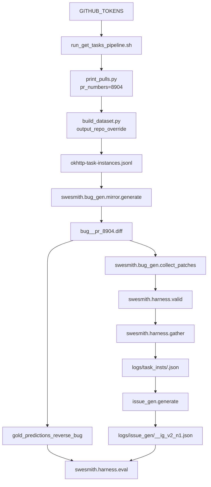

# Redo OkHttp PR-8904 task instance end-to-end (repo-local paths)

## Goal

Create a **valid SWE-smith task instance** for **OkHttp PR-8904** such that:

- The SWE-bench collector outputs an instance with **non-empty `test_patch`** (required for FAIL_TO_PASS tests).
- The instance’s `repo` matches the SWE-smith Kotlin profile key (**`danielzayas/okhttp`**) so profile resolution works.
- The workflow uses the already-built Docker image **`danielzayas/swesmith.x86_64.danielzayas_1776_okhttp.8e0cc1b3`**.

## Auth (no token file)

- Set tokens via env:
- Single token: `export GITHUB_TOKENS="$GITHUB_TOKEN"`
- Multiple tokens: `export GITHUB_TOKENS="t1,t2,t3"`

## Output paths (repo-local)

Use these concrete, descriptive folders inside the repo:

- **PR raw data**: `SWE-bench/outputs/okhttp_pr_8904/prs/`
- **Task instances**: `SWE-bench/outputs/okhttp_pr_8904/tasks/`
- **Golden predictions**: `SWE-bench/outputs/okhttp_pr_8904/gold/`

(If you prefer a different location, just change the `SWE-bench/outputs/okhttp_pr_8904/...` prefix consistently.)

## Code changes (SWE-bench collector)

### 1) Add PR allowlisting (multiple PR numbers)

- Update [`SWE-bench/swebench/collect/run_get_tasks_pipeline.sh`](SWE-bench/swebench/collect/run_get_tasks_pipeline.sh)
- Add optional `--pr-numbers` (multi-arg) and forward to Python.
- Update [`SWE-bench/swebench/collect/print_pulls.py`](SWE-bench/swebench/collect/print_pulls.py)
- Add support for fetching **multiple specific PRs** (e.g. `--pull_numbers 8904 1234`).
- Update [`SWE-bench/swebench/collect/get_tasks_pipeline.py`](SWE-bench/swebench/collect/get_tasks_pipeline.py)
- Add CLI arg `--pr_numbers` (list[int]) and thread it through to `print_pulls`.

### 2) Add fork-output mapping (emit `repo=danielzayas/okhttp`)

- Update [`SWE-bench/swebench/collect/build_dataset.py`](SWE-bench/swebench/collect/build_dataset.py)
- Add optional `--output_repo_full_name danielzayas/okhttp`.
- When set, emit:
    - `repo = "danielzayas/okhttp"`
    - `instance_id` based on that output repo
- Still fetch PR diff + issue text from the upstream PR payload (`square/okhttp`).
- Update [`SWE-bench/swebench/collect/get_tasks_pipeline.py`](SWE-bench/swebench/collect/get_tasks_pipeline.py)
- Forward `--output_repo_full_name` into the dataset build step.

### 3) Fix Kotlin test patch detection (case-insensitive)

- Update [`SWE-bench/swebench/collect/utils.py`](SWE-bench/swebench/collect/utils.py) `extract_patches(...)`
- Make test-path detection case-insensitive (use `hunk.path.lower()`).
- This ensures Kotlin paths like `.../jvmTest/...` land in `test_patch`.

## Execution plan (after code changes)

### A) Create output dirs

From repo root:

- `mkdir -p SWE-bench/outputs/okhttp_pr_8904/prs SWE-bench/outputs/okhttp_pr_8904/tasks SWE-bench/outputs/okhttp_pr_8904/gold`

### B) Crawl only PR-8904 and build a task instance

- `bash SWE-bench/swebench/collect/run_get_tasks_pipeline.sh \

--repos square/okhttp \--path_prs SWE-bench/outputs/okhttp_pr_8904/prs \--path_tasks SWE-bench/outputs/okhttp_pr_8904/tasks \--pr-numbers 8904 \--output-repo-full-name danielzayas/okhttp`**Expected artifact**:

- `SWE-bench/outputs/okhttp_pr_8904/tasks/okhttp-task-instances.jsonl` containing the PR-8904 instance where:
- `repo == "danielzayas/okhttp"`
- `test_patch` is present and **non-empty**

### C) PR mirroring (SWE-smith)

- `python -m swesmith.bug_gen.mirror.generate SWE-bench/outputs/okhttp_pr_8904/tasks/okhttp-task-instances.jsonl --model gemini-3-flash-preview`

### D) Validation + gather (creates branch-per-task)

1) Collect candidate patches:

- `python -m swesmith.bug_gen.collect_patches SWE-smith/logs/bug_gen/<repo_profile_dir>/`

2) Validate:

- `python -m swesmith.harness.valid SWE-smith/logs/bug_gen/<repo_profile_dir>_all_patches.json`

3) Gather:

- `python -m swesmith.harness.gather SWE-smith/logs/run_validation/<run_id>`

Expected:

- `SWE-smith/logs/task_insts/<run_id>.json`

### E) Generate issue text

- `python SWE-smith/swesmith/issue_gen/generate.py SWE-smith/logs/task_insts/<run_id>.json \

--config_file SWE-smith/configs/issue_gen/ig_v2.yaml \--model gemini-3-flash-preview \--n_workers 4 \--experiment_id ig_v2 \--use_existing`Expected:

- `SWE-smith/logs/issue_gen/<run_id>__ig_v2_n1.json`

### F) Golden evaluation

- Create a gold prediction by **reversing** the generated `bug__pr_8904.diff` and writing:
- `SWE-bench/outputs/okhttp_pr_8904/gold/gold_predictions.jsonl`

Then run:

- `python -m swesmith.harness.eval \

--dataset_path SWE-smith/logs/issue_gen/<run_id>__ig_v2_n1.json \--predictions_path SWE-bench/outputs/okhttp_pr_8904/gold/gold_predictions.jsonl \--run_id okhttp_pr8904_gold`

## Docker image usage

Confirm the image exists locally:

- `docker image inspect danielzayas/swesmith.x86_64.danielzayas_1776_okhttp.8e0cc1b3`

If it’s not present locally, pull it once (no rebuild).

## Workflow diagram

